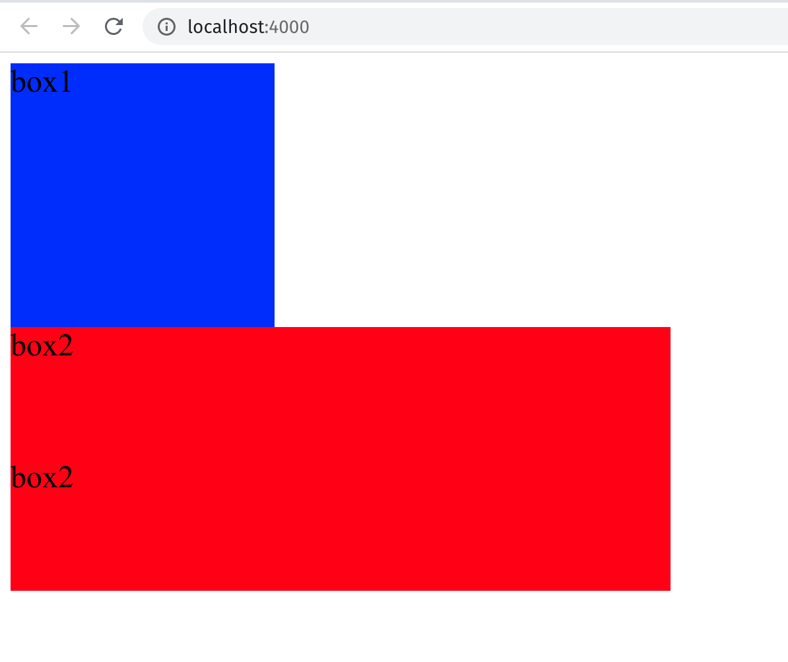

# GulpDemo
A Demo for Gulp 4

- gulp
- gulp-clean-css
- gulp-concat
- gulp-connect
- gulp-htmlmin
- gulp-less
- gulp-livereload
- gulp-load-plugins
- gulp-rename
- gulp-uglify
- open

commands:
```shell
npx gulp
```
<div>

</div>

